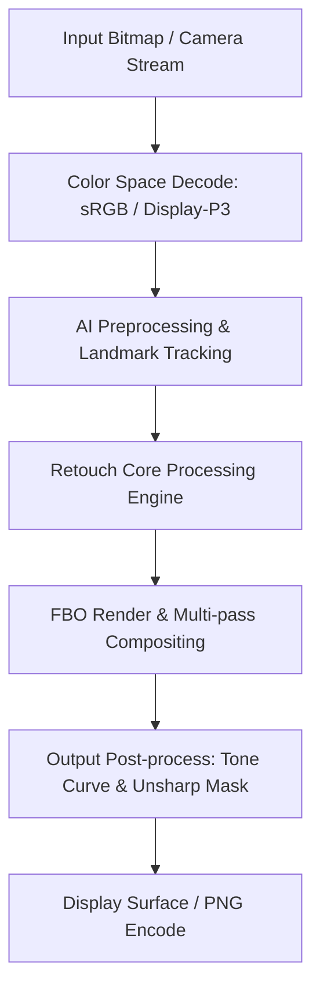

# Image Effect Graph: PicsArt

### Pipeline Details for PicsArt
- **Primary Domain**: Retouch
- **Framework**: libgecore.so + libsmudgetool.so + libbucketfill.so + libnative-filters.so
- **AI Integration**: PicsArt AI Pipeline + Fresco Native Image Pipeline
