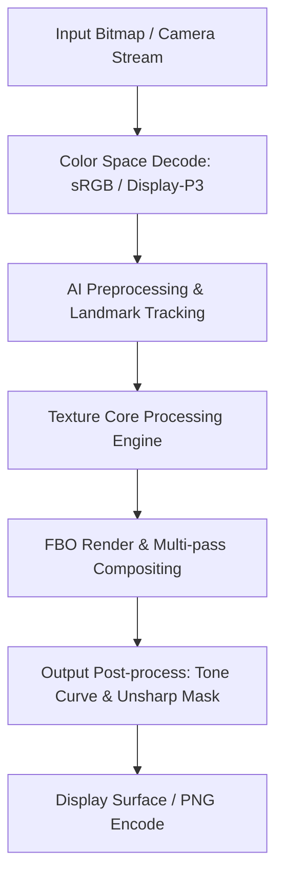

# Image Effect Graph: Remini

### Pipeline Details for Remini
- **Primary Domain**: Texture
- **Framework**: libjavet-v8-android.so + libbuffer.so
- **AI Integration**: Microsoft ONNX Runtime (libonnxruntime.so) + Cloud Super-Resolution
