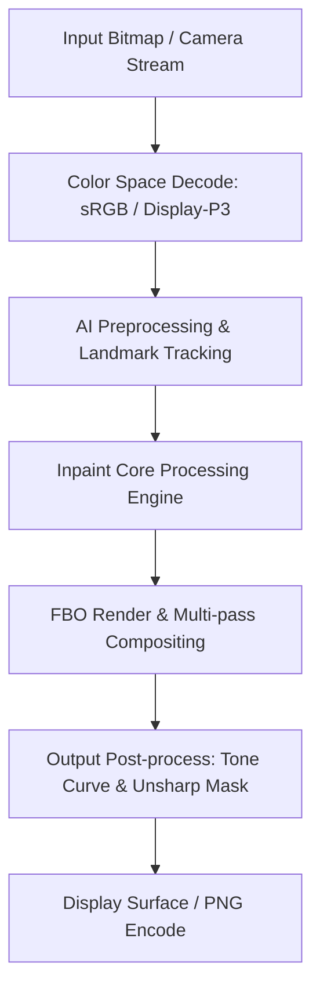

# Image Effect Graph: SnapEdit

### Pipeline Details for SnapEdit
- **Primary Domain**: Inpaint
- **Framework**: libavcodec.so + libavfilter.so + libavformat.so + libswscale.so
- **AI Integration**: MediaPipe SelfieSegmentation FP16 + MobileNetV2 Text Detector
