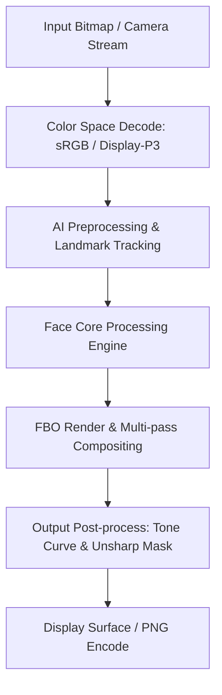

# Image Effect Graph: Time Warp Scan

### Pipeline Details for Time Warp Scan
- **Primary Domain**: Face
- **Framework**: libhscore.so + libcvalgo.so + OpenGL ES
- **AI Integration**: Alibaba MNN (libMNN.so) + libfacelandmarks.so
