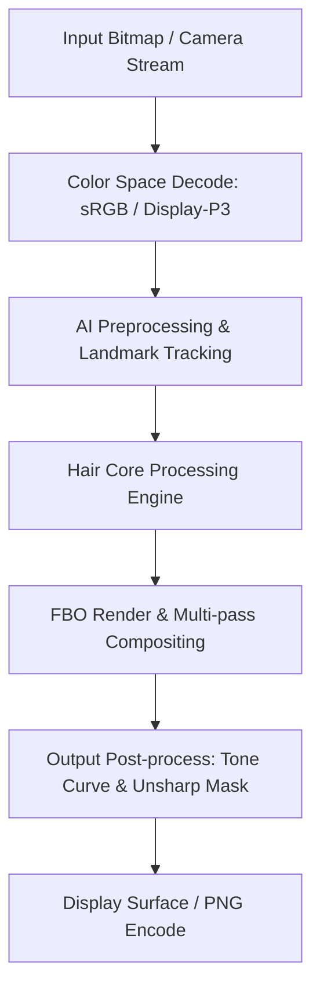

# Image Effect Graph: Ulike

### Pipeline Details for Ulike
- **Primary Domain**: Hair
- **Framework**: libeffect.so (EffectSDK) + libAGFX.so + libbrushEngine.so + libttvesdk.so
- **AI Integration**: ByteNN (libbytenn.so) + Amazing Graphics Engine
