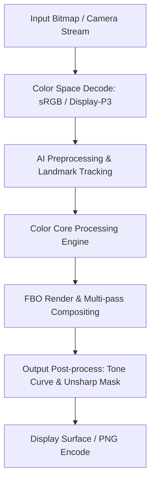

# Image Effect Graph: VSCO

### Pipeline Details for VSCO
- **Primary Domain**: Color
- **Framework**: libvscocore.so + libfragglerock.so + libuniffi_cel.so
- **AI Integration**: TensorFlow Lite + MLKit Common Pipeline
