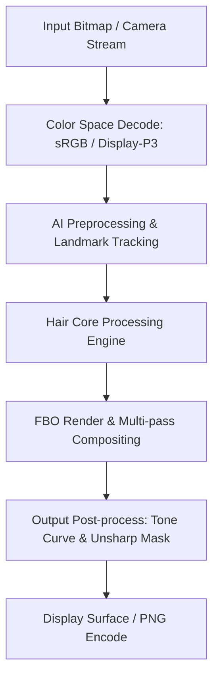

# Image Effect Graph: Wink

### Pipeline Details for Wink
- **Primary Domain**: Hair
- **Framework**: libVERenderer.so + libmtmvcore.so + libarkernel3.so + libPVGColorFunctions.so
- **AI Integration**: Manis NPU Engine + libaidetectionplugin.so + libAIModelKit.so
