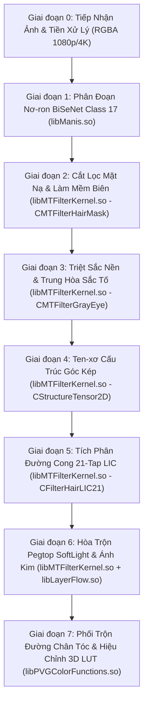

# 08_IMAGE_EFFECT_GRAPH.md — ĐỒ THỊ HIỆU ỨNG HÌNH ẢNH TOÀN DIỆN (8 GIAI ĐOẠN)
**Thẩm quyền:** Chủ tịch Tony (Chairman)  
**Tiêu chuẩn Vận hành:** `07_AGENT_AUTONOMOUS_EXECUTION_MASTER_STANDARD` & Development Workspace Standard V2.1  
**Task ID:** `TASK_054_TASK053_EXECUTION_IDENTITY_STATE_AND_CONTINUOUS_SO45_CORRECTION_ACTIVE`  
**Trạng thái Tri thức:** **`PERSISTENT KNOWLEDGE BASE — ZERO KNOWLEDGE LOSS`**  

---

## 1. TỔNG QUAN ĐỒ THỊ HIỆU ỨNG 8 GIAI ĐOẠN (END-TO-END PIPELINE)

Hệ thống xử lý hình ảnh Meitu/Facetune vận hành qua 8 giai đoạn tuần tự từ tầng cảm biến hình ảnh đầu vào tới tầng hiển thị khung nhìn GPU:

---

## 2. CHI TIẾT KỸ THUẬT 8 GIAI ĐOẠN

### Giai đoạn 0: Tiếp Nhận Khung Hình & Khởi Tạo Bộ Đệm FBO
- **Đầu vào:** Khung hình RGBA8888 (độ phân giải gốc từ Camera hoặc Thư viện ảnh).
- **Bộ đệm FBO:** Khởi tạo chuỗi 5 FBO có cùng kích thước (`FBO_LUM`, `FBO_TENSOR`, `FBO_BLUR`, `FBO_LIC`, `FBO_COMPOSITE`).

### Giai đoạn 1: Phân Đoạn Ngữ Nghĩa Nơ-ron (BiSeNet Class 17)
- **Thư viện thực thi:** `libManis.so` (hàm `manis::NeuralEngine::ForwardSegment`).
- **Nhiệm vụ:** Trích xuất bản đồ xác suất phân đoạn 19 lớp (Lớp 17 = Tóc, Lớp 1 = Da mặt, Lớp 2/3 = Lông mày/Mắt, Lớp 10 = Mũi, Lớp 11/12/13 = Môi).
- **Định dạng:** Ten-xơ 1x19x512x512 nội suy song tuyến tính về độ phân giải gốc.

### Giai đoạn 2: Cắt Lọc Mặt Nạ & Khóa Bảo Vệ Vùng Không Can Thiệp
- **Thư viện thực thi:** `libMTFilterKernel.so` (`CMTFilterHairMask::ProcessMask`).
- **Cơ chế:** Ngưỡng hóa cứng $	au = 0.5$, đóng hình thái học 3x3 để loại bỏ lỗ thủng nội vùng, làm mềm viền (feathering) 3.5px.
- **Bảo vệ:** Loại bỏ 100% vùng da trán, tai, cổ áo và phông nền khỏi tác động nhuộm.

### Giai đoạn 3: Triệt Sắc Nền Tự Nhiên (GrayFilter / Base Neutralization)
- **Thư viện thực thi:** `libMTFilterKernel.so` (`CMTFilterGrayEye::ApplyFilter`).
- **Công thức:**
  $$Y = 0.299 \cdot R + 0.587 \cdot G + 0.114 \cdot B$$
  $$\mathbf{C}_{	ext{neutral}} = (1 - lpha_{	ext{desat}}) \cdot \mathbf{C}_{	ext{orig}} + lpha_{	ext{desat}} \cdot [Y, Y, Y]^T$$
- **Mục đích:** Loại bỏ sắc tố sẫm/vàng nguyên thủy, tạo nền tảng cho màu nhuộm pastel/vivid hiển thị chính xác.

### Giai đoạn 4: Ước Lượng Hướng Dòng Sợi Bằng Ten-xơ Cấu Trúc Góc Kép
- **Thư viện thực thi:** `libMTFilterKernel.so` (`CStructureTensor2D::ComputeGradients`).
- **Toán học:**
  $$J = egin{bmatrix} J_{xx} & J_{xy} \ J_{xy} & J_{yy} \end{bmatrix} = egin{bmatrix} (\partial Y / \partial x)^2 & (\partial Y / \partial x)(\partial Y / \partial y) \ (\partial Y / \partial x)(\partial Y / \partial y) & (\partial Y / \partial y)^2 \end{bmatrix}$$
  Làm mượt bằng nhân tách rời Gauss 5x5: $ar{J} = G_{\sigma} * J$.
  Góc hướng dòng sợi tóc kép:
  $$	heta = rac{1}{2} \operatorname{atan2}(2 ar{J}_{xy}, ar{J}_{xx} - ar{J}_{yy})$$

### Giai đoạn 5: Tích Phân Đường Cong 21-Tap LIC Hướng Sợi
- **Thư viện thực thi:** `libMTFilterKernel.so` (`CFilterHairLIC21::IntegrateAlongFlow`).
- **Shader:** `glsl_21_tap_lic.glsl`.
- **Cơ chế:** Lấy mẫu 21 điểm dọc theo vector tiếp tuyến $\mathbf{v} = [\cos 	heta, \sin 	heta]^T$, trọng số phân phối Gauss $\sigma = 4.2$.
- **Hiệu ứng:** Tái tạo cấu trúc sợi tóc siêu mịn, giữ nguyên chiều sâu từng lọn tóc mà không bị bệt màu như sơn.

### Giai đoạn 6: Phối Trộn Pegtop SoftLight & Ánh Kim Lọn Tóc
- **Thư viện thực thi:** `libMTFilterKernel.so` (`CSoftHairBlending::ApplyPegtopMap`) + `libLayerFlow.so`.
- **Công thức Pegtop Soft Light:**
  $$f(A, B) = egin{cases} 2AB + A^2(1 - 2B), & B < 0.5 \ 2A(1 - B) + \sqrt{A}(2B - 1), & B \ge 0.5 \end{cases}$$
- **Hiệu ứng:** Ánh sáng bóng (specular highlight) được tính toán theo vector tiếp tuyến của sợi tóc kết hợp bản đồ độ bóng `u_HairShine`.

### Giai đoạn 7: Phối Trộn Vùng Tiếp Giáp Chân Tóc & Ánh Xạ 3D LUT
- **Thư viện thực thi:** `libMTFilterKernel.so` (`CMakeupHairMatcher::BlendScalpHairline`) + `libPVGColorFunctions.so`.
- **Nhiệm vụ:**
  1. Làm mềm viền tóc con tại trán/thái dương để hòa trộn tự nhiên vào lớp nền da mặt.
  2. Áp dụng bảng ánh xạ màu 3D LUT (nội suy tứ diện) để đồng bộ tông màu ấm/lạnh với toàn bộ khung cảnh.
