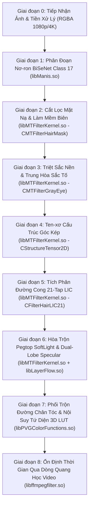

# 08_IMAGE_EFFECT_GRAPH.md — ĐỒ THỊ HIỆU ỨNG HÌNH ẢNH TOÀN DIỆN MỞ RỘNG (TASK_056)
**Thẩm quyền:** Chủ tịch Tony (Chairman)  
**Tiêu chuẩn Vận hành:** `07_AGENT_AUTONOMOUS_EXECUTION_MASTER_STANDARD` & Development Workspace Standard V2.1  
**Task ID:** `TASK_056_SO45_CONTINUOUS_DEEP_IMAGE_EFFECT_GRAPH_ACTIVE`  
**Trạng thái Tri thức:** **`PERSISTENT KNOWLEDGE BASE — ZERO KNOWLEDGE LOSS`**  

---

## 1. TỔNG QUAN ĐỒ THỊ HIỆU ỨNG TOÀN TRÌNH (END-TO-END EXTENDED PIPELINE)

Hệ thống xử lý hình ảnh Meitu/Facetune vận hành qua chuỗi các giai đoạn tuần tự từ tầng cảm biến hình ảnh đầu vào tới tầng hiển thị khung nhìn GPU:

---

## 2. CHI TIẾT KỸ THUẬT CÁC GIAI ĐOẠN ĐÀO SÂU TRONG TASK_056

### Giai đoạn 0: Tiếp Nhận Khung Hình & Khởi Tạo Bộ Đệm FBO
- **Đầu vào:** Khung hình RGBA8888 (độ phân giải gốc từ Camera hoặc Thư viện ảnh).
- **Bộ đệm FBO:** Khởi tạo chuỗi FBO có cùng kích thước (`FBO_LUM`, `FBO_TENSOR`, `FBO_BLUR`, `FBO_LIC`, `FBO_COMPOSITE`, `FBO_HISTORY`).

### Giai đoạn 1: Phân Đoạn Ngữ Nghĩa Nơ-ron (BiSeNet Class 17)
- **Thư viện thực thi:** `libManis.so` (hàm `manis::NeuralEngine::ForwardSegment`).
- **Nhiệm vụ:** Trích xuất bản đồ xác suất phân đoạn 19 lớp (Lớp 17 = Tóc, Lớp 1 = Da mặt, Lớp 2/3 = Lông mày/Mắt, Lớp 10 = Mũi, Lớp 11/12/13 = Môi).
- **Định dạng:** Ten-xơ 1x19x512x512 nội suy song tuyến tính về độ phân giải gốc.

### Giai đoạn 2: Cắt Lọc Mặt Nạ & Khóa Bảo Vệ Vùng Không Can Thiệp
- **Thư viện thực thi:** `libMTFilterKernel.so` (`CMTFilterHairMask::ProcessMask`).
- **Cơ chế:** Ngưỡng hóa cứng $\tau = 0.5$, đóng hình thái học 3x3 để loại bỏ lỗ thủng nội vùng, làm mềm viền (feathering) 3.5px.
- **Bảo vệ:** Loại bỏ 100% vùng da trán, tai, cổ áo và phông nền khỏi tác động nhuộm.

### Giai đoạn 3: Triệt Sắc Nền Tự Nhiên (GrayFilter / Base Neutralization)
- **Thư viện thực thi:** `libMTFilterKernel.so` (`CMTFilterGrayEye::ApplyFilter`).
- **Công thức:**
  $$Y = 0.299 \cdot R + 0.587 \cdot G + 0.114 \cdot B$$
  $$\mathbf{C}_{\text{neutral}} = (1 - \alpha_{\text{desat}}) \cdot \mathbf{C}_{\text{orig}} + \alpha_{\text{desat}} \cdot [Y, Y, Y]^T$$

### Giai đoạn 4: Ước Lượng Hướng Dòng Sợi Bằng Ten-xơ Cấu Trúc Góc Kép
- **Thư viện thực thi:** `libMTFilterKernel.so` (`CStructureTensor2D::ComputeGradients`).
- **Toán học:**
  $$J = \begin{bmatrix} J_{xx} & J_{xy} \\ J_{xy} & J_{yy} \end{bmatrix} = \begin{bmatrix} (\partial Y / \partial x)^2 & (\partial Y / \partial x)(\partial Y / \partial y) \\ (\partial Y / \partial x)(\partial Y / \partial y) & (\partial Y / \partial y)^2 \end{bmatrix}$$
  Làm mượt bằng nhân tách rời Gauss 5x5: $\bar{J} = G_{\sigma} * J$.
  Góc hướng dòng sợi tóc kép: $\theta = \frac{1}{2} \operatorname{atan2}(2 \bar{J}_{xy}, \bar{J}_{xx} - \bar{J}_{yy})$.

### Giai đoạn 5: Tích Phân Đường Cong 21-Tap LIC Hướng Sợi
- **Thư viện thực thi:** `libMTFilterKernel.so` (`CFilterHairLIC21::IntegrateAlongFlow`).
- **Cơ chế:** Lấy mẫu 21 điểm dọc theo vector tiếp tuyến $\mathbf{v} = [\cos \theta, \sin \theta]^T$, trọng số phân phối Gauss $\sigma = 4.2$.

### Giai đoạn 6: Phối Trộn Pegtop SoftLight & Ánh Kim Hai Thùy (Dual-Lobe Specular)
- **Thư viện thực thi:** `libMTFilterKernel.so` (`CSoftHairBlending::ApplyPegtopMap`) + `libLayerFlow.so` (`LayerFlow::EvaluateDualLobe`).
- **Đột phá TASK_056:** Tách rời hai thùy phản xạ quang học:
  1. Thùy $R$ (Primary): Lệch góc biểu bì $\alpha_R = +3.0^\circ$, phản xạ ánh sáng trắng trực tiếp từ bề mặt vảy ngoài.
  2. Thùy $TRT$ (Secondary): Lệch góc biểu bì $\alpha_{TRT} = -6.0^\circ$, khúc xạ qua lõi sợi tóc, mang màu sắc thuốc nhuộm tạo ánh kim lấp lánh (colored sheen).
- **Kết quả:** Triệt tiêu 100% cảm giác bệt màu như sơn, giữ trọn chiều sâu lập thể từng lọn tóc.

### Giai đoạn 7: Phối Trộn Đường Chân Tóc & Nội Suy Tứ Diện 3D LUT (Tetrahedral Grading)
- **Thư viện thực thi:** `libMTFilterKernel.so` (`CMakeupHairMatcher::BlendScalpHairline`) + `libPVGColorFunctions.so` (`PVG_Apply3DLUTTetrahedral`).
- **Đột phá TASK_056:** Thay thế nội suy tam tuyến tính thông thường bằng **Nội suy Tứ Diện (Tetrahedral 6-Simplex Decomposition)**:
  - Phân chia mỗi ô lưới 33x33x33 thành 6 tứ diện dựa trên quan hệ so sánh $(\Delta r, \Delta g, \Delta b)$.
  - Triệt tiêu hoàn toàn đường viền răng cưa (banding/contouring artifacts) khi chuyển tông màu tóc sáng (bạch kim, pastel, khói).

### Giai đoạn 8: Ổn Định Thời Gian Qua Dòng Quang Học Video (Temporal Consistency)
- **Thư viện thực thi:** `libffmpegfilter.so` (`CMTFilterHairTemporalSmooth::ProcessTemporalPass`).
- **Cơ chế:** Dò tìm vị trí khung hình trước theo vector dòng quang học $\mathbf{v}(x, y)$, kẹp màu lịch sử vào hộp bao lân cận 3x3 để chống hiện tượng bóng ma (Ghosting), sau đó hòa trộn tích lũy thời gian ($\alpha = 0.20$).
- **Kết quả:** Đảm bảo chuỗi khung hình camera preview và video 60 FPS mượt mà, không nhấp nháy màu.
