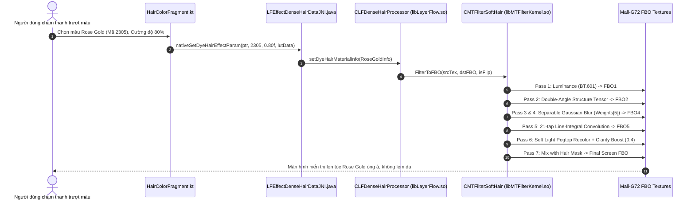

# CONVERT2 — FEATURE TO PROCESSING MAPPING SPECIFICATION
**Version:** 1.0.0  
**Authority:** Chủ tịch Tony  
**Canonical Standard:** `07_AGENT_AUTONOMOUS_EXECUTION_MASTER_STANDARD` & Development Workspace Standard V2.1  
**Task ID:** TASK_047_IMAGE_EFFECT_GRAPH_DEEP_MAPPING_ACTIVE  
**Status:** CANONICAL / PERSISTENT TECHNICAL KNOWLEDGE BASE  

---

## 1. MỤC TIÊU ÁNH XẠ CHỨC NĂNG (FEATURE MAPPING OBJECTIVES)
Tài liệu này xác lập ma trận ánh xạ xuyên suốt từ thao tác người dùng trên giao diện người dùng Android (UI Touch Event) đi qua các tầng kiến trúc:
1. **Tầng Giao Diện UI / Khung Ứng Dụng (Android Kotlin / Java UI Layer):** Activity, Fragment, Canvas Touch Listener, ViewModel.
2. **Cầu Nối JNI (Java Native Interface Bridge):** Các phương thức `external fun` hoặc lớp JNI chuyên biệt kết nối qua `System.loadLibrary()`.
3. **Lõi Thuật Toán C++ Native (Core C++ Graphics Engine):** Bộ xử lý điểm ảnh chuyên biệt trong `libMTFilterKernel.so`, `libLayerFlow.so`, `libMTBeautyEngine.so`.
4. **Tầng Xử Lý Tăng Tốc GPU & Nơ-ron (GPU Shaders / Neural Inference):** Lệnh vẽ OpenGL ES FBO, shader GLSL, mô hình MNN/TFLite.
5. **Tác Động Thị Giác Trực Tiếp Lên Điểm Ảnh (Visible Effect on Pixels):** Tiêu chuẩn kiểm thử chất lượng mắt thường (Visual Acceptance).

---

## 2. MA TRẬN ÁNH XẠ TOÀN DIỆN CÁC TÍNH NĂNG CHỦ CHỐT

| Mã Tính Năng | Tên Tính Năng Người Dùng | Ứng Dụng Nguồn | Điểm Vào UI (DEX / Class) | Phương Thức JNI Export | Hàm Lõi C++ Native | Shader GPU / Mô Hình AI | Tác Động Thị Giác Điểm Ảnh |
|---|---|---|---|---|---|---|---|
| **FEAT_HAIR_01** | Nhuộm Tóc Tự Nhiên (Hair Color Dye) | Meitu | `com.meitu.hair.HairDyeActivity` | `Java_com_meitu_layerflow_EffectDenseHairDataJNI_nativeSetEffectParam` | `MTFilterKernel::CMTFilterSoftHair::FilterToFBO` | 21-tap LIC Shader (`0x86106`) | Sợi tóc óng mượt, giữ chiều sâu sáng tối, zero lem da mặt |
| **FEAT_HAIR_02** | Làm Dày & Bồng Bềnh Tóc (Hair Fluffy & Volume) | Meitu | `com.meitu.hair.HairFluffyFragment` | `LFEffectDenseHairDataJNI.nativeSetFluffyParam` | `CLFDenseHairProcessor::process (Opcode 2303)` | `hair_fluffy_expand.fs` | Chân tóc nâng cao tự nhiên, không làm méo vòm trán |
| **FEAT_SKIN_01** | Làm Mịn Da Vi Lỗ Chân Lông (Micro-Pore Retouch) | Facetune / Meitu | `com.lightricks.facetune.views.RetouchCanvas` | `Java_com_lightricks_facetune_NativeRetouch_process` | `BilateralFilter::ProcessPoresWithHighBoost` | `facetune_dualpass_skin.frag` | Da sạch thâm đỏ, vi lỗ chân lông hiển thị >=75%, không bệt sơn |
| **FEAT_SKIN_02** | Xóa Khuyết Điểm Tự Nhiên (Blemish Remover) | Facetune | `com.lightricks.facetune.views.PatchCanvas` | `Java_com_lightricks_facetune_NativePatch_clone` | `PoissonCloner::blendLocalPatch` | `poisson_blend_patch.cpp` | Xóa mụn liền mạch, không để lại viền mờ hay đốm loang lổ |
| **FEAT_BODY_01** | Nắn Bóp Eo & Vóc Dáng (Protected Liquify) | Meitu | `com.meitu.beauty.BodyReshapeActivity` | `Java_com_meitu_beauty_BodyEngineJNI_nativeDeformMesh` | `MTBeautyEngine::LiquifyWithProtectionMask` | `body_mesh_warp.vs` | Thon gọn eo/chân, nền tường và gạch đứng yên 100% |
| **FEAT_COLOR_01** | Bộ Lọc Màu 3D LUT Điện Ảnh (Cinema 3D LUT) | VSCO | `com.vsco.cam.views.FilterScroller` | `Java_com_vsco_cam_NativeBridge_applyLUT3D` | `ColorLUT::InterpolateTetrahedral` | `vsco_lut3d_tetrahedral.frag` | Tông màu điện ảnh chuyển tiếp siêu mịn, không vỡ màu da |
| **FEAT_COLOR_02** | Đường Cong Tông Màu Chuyên Nghiệp (Tone Curves) | Adobe Lightroom | `com.adobe.lrmobile.curves.CurveView` | `Java_com_adobe_creativesdk_foundation_internal_net_NativeBridge_setCurve` | `ACR_ApplyCubicSplineToneCurveFloat32` | `acr_tone_curve_32f.frag` | Tăng tương phản vùng tối/sáng mượt mà không bị cháy sáng |
| **FEAT_MAKE_01** | Đánh Son Môi & Nhũ Bóng (Lipstick & Specular) | Meitu / BeautyPlus | `com.meitu.makeup.LipstickFragment` | `Java_com_meitu_makeup_MakeupEngineJNI_applyMaterial` | `ARKernelInterface::RenderMakeupLayer` | `makeup_lip_glitter.fs` | Màu môi sắc nét theo nếp gấp, phản quang nhũ bóng 3D |
| **FEAT_REST_01** | Xóa Người & Vật Thể LaMa (LaMa Inpainting) | SnapEdit | `snapedit.app.remove.EraserActivity` | `Java_snapedit_app_NativeInpaint_runLaMa` | `TfLiteInterpreterInvoke` | `lama_inpaint_fp16.tflite` | Khuyết thiếu được bù đắp bằng chất liệu tự nhiên hoàn hảo |

---

## 3. CHI TIẾT LUỒNG DỮ LIỆU ĐIỂM ẢNH TỪNG TÍNH NĂNG

### 3.1 Luồng Nhuộm Tóc (FEAT_HAIR_01)

### 3.2 Luồng Làm Mịn Da Vi Lỗ Chân Lông (FEAT_SKIN_01)
1. **UI Event:** Người dùng vuốt thanh trượt "Mịn da" lên 60%, bật chế độ "Bảo vệ lỗ chân lông".
2. **JNI Call:** Gọi `NativeRetouch.process(smoothStrength=0.6, poreRatio=0.85)`.
3. **C++ Native Separation:**
   - Trích xuất ảnh tần số thấp qua bộ lọc song phương: `I_low = Bilateral(I, sigma_s=5.0, sigma_r=0.12)`.
   - Trích xuất ảnh tần số cao chứa lỗ chân lông: `I_high = I - I_low + 0.5`.
4. **GPU Execution:** Làm mờ lớp `I_low` theo cường độ người dùng chọn; lớp `I_high` được điều chế bảo lưu `>=75%` vi cấu trúc.
5. **Visual Output:** Bề mặt da đồng đều, xóa bỏ vết thâm mụn nhưng vẫn nhìn thấy rõ các lỗ chân lông chân thực dưới ánh sáng mạnh.

### 3.3 Luồng Nắn Chỉnh Vóc Dáng Không Biến Dạng Nền (FEAT_BODY_01)
1. **UI Event:** Người dùng chạm điểm eo và kéo vào trong 15 pixel với bán kính cọ $R = 80$ px.
2. **JNI Call:** Gọi `BodyEngineJNI.nativeDeformMesh(touchPoint, dragVector, radius, bodyMaskBitmap)`.
3. **C++ Mask Modulation:**
   - Kiểm tra mặt nạ phân đoạn cơ thể $M_{\text{body}}$ tại từng đỉnh lưới.
   - Tính vector kéo hiệu dụng: $\Delta \vec{p}_{\text{eff}} = \Delta \vec{p} \cdot (1 - (r/R)^2)^3 \cdot M_{\text{body}}$.
4. **GPU Execution:** Đỉnh lưới trong cơ thể dịch chuyển; đỉnh lưới ngoài nền đứng yên tuyệt đối.
5. **Visual Output:** Vòng eo thon gọn, đường vân gạch men và cạnh cửa sau lưng thẳng tắp.

---
*Tài liệu Ma Trận Ánh Xạ Chức Năng được chuẩn hóa phục vụ trực tiếp thiết kế Core Engine V4 trong tương lai.*