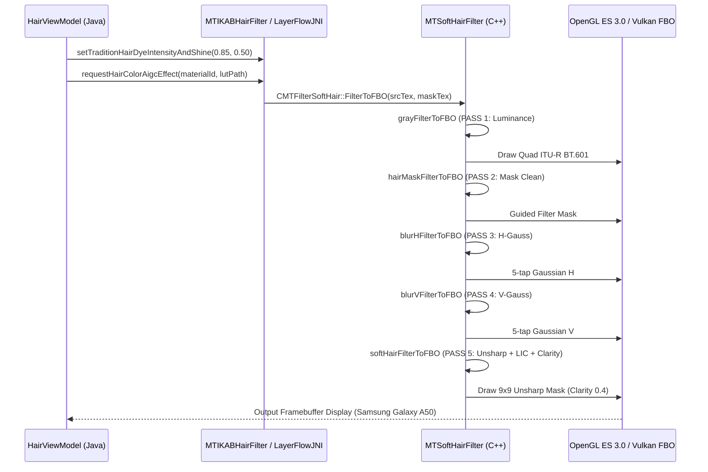

# HAIR PIPELINE CALLGRAPH SPECIFICATION

```mermaid
sequenceDiagram
    participant UI as HairViewModel (Java)
    participant JNI as MTIKABHairFilter / LayerFlowJNI
    participant Core as MTSoftHairFilter (C++)
    participant GPU as OpenGL ES 3.0 / Vulkan FBO

    UI->>JNI: setTraditionHairDyeIntensityAndShine(0.85, 0.50)
    UI->>JNI: requestHairColorAigcEffect(materialId, lutPath)
    JNI->>Core: CMTFilterSoftHair::FilterToFBO(srcTex, maskTex)
    Core->>Core: grayFilterToFBO (PASS 1: Luminance)
    Core->>GPU: Draw Quad ITU-R BT.601
    Core->>Core: hairMaskFilterToFBO (PASS 2: Mask Clean)
    Core->>GPU: Guided Filter Mask
    Core->>Core: blurHFilterToFBO (PASS 3: H-Gauss)
    Core->>GPU: 5-tap Gaussian H
    Core->>Core: blurVFilterToFBO (PASS 4: V-Gauss)
    Core->>GPU: 5-tap Gaussian V
    Core->>Core: softHairFilterToFBO (PASS 5: Unsharp + LIC + Clarity)
    Core->>GPU: Draw 9x9 Unsharp Mask (Clarity 0.4)
    GPU-->>UI: Output Framebuffer Display (Samsung Galaxy A50)
```
