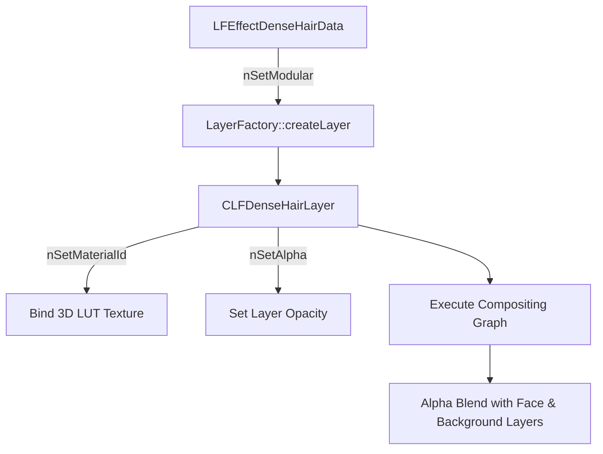

# LAYERFLOW COMPOSITING CALLGRAPH SPECIFICATION

```mermaid
graph TD
    A[LFEffectDenseHairData] -->|nSetModular| B[LayerFactory::createLayer<LFDenseHairModular>]
    B --> C[CLFDenseHairLayer]
    C -->|nSetMaterialId| D[Bind 3D LUT Texture]
    C -->|nSetAlpha| E[Set Layer Opacity]
    C --> F[Execute Compositing Graph]
    F --> G[Alpha Blend with Face & Background Layers]
```
