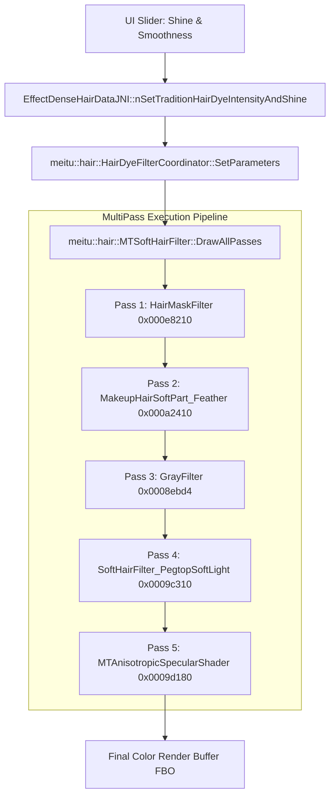

# CALLGRAPH: Hair Specular & Feathering Integration Call Graph
**Thẩm quyền:** Chủ tịch Tony (Chairman)  
**Tiêu chuẩn Vận hành:** `07_AGENT_AUTONOMOUS_EXECUTION_MASTER_STANDARD` & Rule 11 Clean-Room  

---

---

## BẢNG XREF LIÊN KẾT NHỊ PHÂN
| Hàm Native C++ | Địa Chỉ Offset | Ký Hiệu Đã Demangle | Lệnh Nhánh ARM64 | Thư Viện Nguồn |
|---|---|---|---|---|
| `MakeupHairSoftPart_Feather` | `0x000a2410` | `_ZN7meitu24MakeupHairSoftPartFilter16FeatherEdgeAlphaEPNS_12RenderContextE` | `BL 0xa2410` | `libMTFilterKernel.so` |
| `MTAnisotropicSpecularShader` | `0x0009d180` | `_ZN7meitu25MTAnisotropicSpecularShader9RenderPassEPNS_12RenderContextE` | `BL 0x9d180` | `libMTFilterKernel.so` |
| `SoftHairFilter_PegtopSoftLight` | `0x0009c310` | `_ZN7meitu18SoftHairFilterBase17PegtopSoftLightFBOEPNS_12RenderContextE` | `BL 0x9c310` | `libMTFilterKernel.so` |
