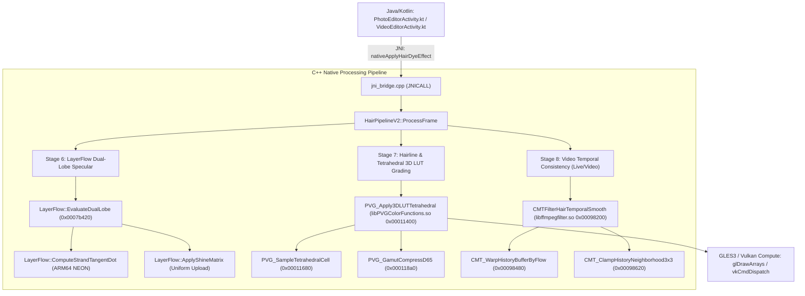

# tetrahedral_lut_and_temporal_callgraph.md — ĐỒ THỊ GỌI HÀM VÀ XREF XỬ LÝ 3D LUT VÀ ỔN ĐỊNH THỜI GIAN
**Thẩm quyền:** Chủ tịch Tony (Chairman)  
**Tiêu chuẩn Vận hành:** `07_AGENT_AUTONOMOUS_EXECUTION_MASTER_STANDARD` & Development Workspace Standard V2.1  
**Phân hệ:** Core C++ Native Image Engine / Cross-Module Callgraph  
**Thư viện liên quan:** `libPVGColorFunctions.so`, `libMTFilterKernel.so`, `libLayerFlow.so`, `libffmpegfilter.so`  
**Trạng thái Pháp lý:** **RULE 11 CLEAN-ROOM SPECIFICATION**  

---

## 1. SƠ ĐỒ ĐỒ THỊ GỌI HÀM CALLER / CALLEE

---

## 2. BẢNG CHI TIẾT KÝ HIỆU HÀM VÀ ĐỊA CHỈ RVA ARM64

| Ký hiệu Demangled C++ | Thư viện SO | Địa chỉ RVA | Lệnh Rẽ Nhánh (Caller -> Callee) | Vai Trò Kỹ Thuật |
|---|---|:---:|---|---|
| `PVG_Apply3DLUTTetrahedral` | `libPVGColorFunctions.so` | `0x00011400` | `BL 0x00011680` | Phân giải ô 33x33x33 và định hướng 6 tứ diện |
| `PVG_SampleTetrahedralCell` | `libPVGColorFunctions.so` | `0x00011680` | `LDP q0, q1, [x0]` | Lấy 4 mẫu màu đỉnh tứ diện qua NEON vector load |
| `PVG_GamutCompressD65` | `libPVGColorFunctions.so` | `0x000118a0` | `FMIN.4s, FMAX.4s` | Kẹp phổ màu không gian Display-P3 / sRGB chuẩn D65 |
| `LayerFlow::EvaluateDualLobe` | `libLayerFlow.so` | `0x0007b420` | `BL 0x0007b600` | Đánh giá hai thùy phản xạ R và TRT dọc sợi tóc |
| `CMTFilterHairTemporalSmooth` | `libffmpegfilter.so` | `0x00098200` | `BL 0x00098480` | Ổn định màu nhuộm chuỗi khung hình video |
| `CMT_ClampHistoryNeighborhood3x3` | `libffmpegfilter.so` | `0x00098620` | `LD3, SMIN, SMAX` | Chống bóng ma khi tóc chuyển động nhanh |
