# CÂY PHÂN CẤP CHỨC NĂNG CHỈNH SỬA ẢNH (EDITPHOTO) CHUẨN 100% NGUYÊN BẢN MEITU
> **Mã đường dẫn Admin CMS:** `http://127.0.0.1:9999/admin/Editphoto`  
> **API Cấu trúc phân cấp:** `http://127.0.0.1:9999/api/editphoto/hierarchy`  
> **Tổng quy mô kiểm soát:** 158 Chức năng chi tiết (62 VIP • 96 Free)  
> **Liên kết JNI C++:** 45 Thư viện `.so` Native ARM64-v8a  
> **Thời gian thẩm định:** 2026-09-24  

---

## 1. TỔNG QUAN MA TRẬN 4 TẦNG PHÂN CẤP

```mermaid
graph TD
    Root["CẤP 0: Chỉnh Sửa Ảnh Toàn Năng (Editphoto Engine)"]
    
    Root --> C1["CẤP 1: 1. Chỉnh Sửa Cơ Bản (Basic Edit)"]
    Root --> C2["CẤP 1: 2. Làm Đẹp Chân Dung (Portrait Beauty)"]
    Root --> C3["CẤP 1: 3. Trang Điểm Kỹ Thuật Số (Digital Makeup)"]
    Root --> C4["CẤP 1: 4. Bộ Lọc & 3D LUTs (Color Filters)"]
    Root --> C5["CẤP 1: 5. Công Cụ Trí Tuệ Nhân Tạo (AI Magic)"]
    Root --> C6["CẤP 1: 6. Chữ & Nhãn Dán (Stickers & Text)"]
    Root --> C7["CẤP 1: 7. Ghép Ảnh & Viền (Collage & Frames)"]

    C1 --> G1_1["CẤP 2 (Cháu): Cắt, Xoay & Phối Cảnh"]
    C1 --> G1_2["CẤP 2 (Cháu): Ánh Sáng & Sắc Độ"]
    C1 --> G1_3["CẤP 2 (Cháu): HSL & Đường Cong RGB"]
    C1 --> G1_4["CẤP 2 (Cháu): Làm Mờ & Xóa Phông Bokeh"]

    C2 --> G2_1["CẤP 2 (Cháu): Làn Da Hoàn Hảo (Skin Master)"]
    C2 --> G2_2["CẤP 2 (Cháu): Điêu Khắc Khuôn Mặt 3D"]
    C2 --> G2_3["CẤP 2 (Cháu): Mắt Sáng Long Lanh"]
    C2 --> G2_4["CẤP 2 (Cháu): Mũi, Miệng & Răng Trắng"]
    C2 --> G2_5["CẤP 2 (Cháu): Vóc Dáng & Chiều Cao"]

    C3 --> G3_1["CẤP 2 (Cháu): Son Môi 5 Hiệu Ứng"]
    C3 --> G3_2["CẤP 2 (Cháu): Phấn Mắt & Eyeliner & Mi 3D"]
    C3 --> G3_3["CẤP 2 (Cháu): Má Hồng, Lông Mày & Nhuộm Tóc"]

    C4 --> G4_1["CẤP 2 (Cháu): 127 Bảng Màu 3D LUTs"]
    C4 --> G4_2["CẤP 2 (Cháu): Hạt Phim & Lóa Sáng Analog"]

    C5 --> G5_1["CẤP 2 (Cháu): AI Inpainting & Xóa Người Lạ"]
    C5 --> G5_2["CẤP 2 (Cháu): Đổi Trời, Mở Rộng Ảnh & 4K Restore"]

    C6 --> G6_1["CẤP 2 (Cháu): 29 Phông Chữ & Chữ 3D"]
    C6 --> G6_2["CẤP 2 (Cháu): Bút Vẽ Phát Sáng & Mosaic Che"]

    C7 --> G7_1["CẤP 2 (Cháu): Ghép Lưới 2-9 Ảnh & Scrapbook"]
    C7 --> G7_2["CẤP 2 (Cháu): Khung Polaroid & Nền Canvas"]
```

---

## 2. BẢNG CHI TIẾT ĐẦY ĐỦ TỪNG CHỨC NĂNG (CHA ➜ CON ➜ CHÁU ➜ CHẮT ➜ CHÚT)

### 📂 PHÂN HỆ 1: CHỈNH SỬA CƠ BẢN & KHUNG HÌNH (BASIC EDIT)
| Menu Cháu (Cấp 2) | Công Cụ Chắt (Cấp 3) | Điều Khiển | Phân Hạng | Thư Viện C++ (.so) | Hàm JNI Native (Cấp 4 - Chút) |
|---|---|---|:---:|---|---|
| **Cắt, Xoay & Phối Cảnh** | Cắt Tỷ Lệ Đa Dạng (1:1, 4:3, 16:9, 9:16, 3:2, Tự Do) | Lưới Cắt Kéo Thả | Free | `libLayerFlow.so` | `nativeCropCanvas(handle, x, y, w, h, ratio)` |
| | Xoay Góc Tự Do 360° & Lật Gương Đối Xứng | Slider Góc & Nút Lật | Free | `libLayerFlow.so` | `nativeRotateCanvas(handle, degree, flipX, flipY)` |
| | Nắn Phối Cảnh 3D (Keystone 4 Góc) | Lưới 4 Điểm Ghim | **👑 VIP** | `libarkernel3.so` | `nativeWarpPerspective(handle, srcQuad, dstQuad)` |
| **Ánh Sáng & Sắc Độ** | Độ Sáng & Độ Tương Phản (Brightness / Contrast) | Slider (-100 đến +100) | Free | `libMTFilterKernel.so` | `nativeSetBrightnessContrast(handle, b, c)` |
| | Vùng Sáng & Vùng Tối HDR (Highlights / Shadows) | Slider (0 đến 100) | Free | `libMTFilterKernel.so` | `nativeTuneHighlightsShadows(handle, hi, sh)` |
| | Độ Bão Hòa & Độ Tươi Màu (Saturation / Vibrance) | Slider (-100 đến +100) | Free | `libPVGColorFunctions.so` | `nativeAdjustColorSaturation(handle, sat, vib)` |
| | Cân Bằng Trắng & Nhiệt Độ Màu (White Balance Kelvin) | Slider Kép (Ấm/Lạnh) | Free | `libPVGColorFunctions.so` | `nativeSetWhiteBalance(handle, kelvin, tint)` |
| | Độ Sắc Nét & Trong Trẻo (Sharpness & Clarity) | Slider (0 đến 100) | Free | `libMTFilterKernel.so` | `nativeApplyUnsharpMask(handle, amount, radius)` |
| | Hạt Phim Cổ Điển (Film Grain Analog) | Slider Kích Thước Hạt | **👑 VIP** | `libfantasy.so` | `nativeRenderFilmGrain(handle, intensity, size)` |
| | Tối Góc Nghệ Thuật (Lens Vignette) | Slider Độ Sâu & Bo Tròn | Free | `libMTFilterKernel.so` | `nativeApplyVignette(handle, amount, midpoint)` |
| **Màu Sắc Nâng Cao** | Bộ Trộn Màu HSL 8 Kênh (Hue, Saturation, Lightness) | 8 Kênh Màu + 3 Sliders | **👑 VIP** | `libPVGColorFunctions.so` | `nativeSetSelectiveHSL(handle, ch, h, s, l)` |
| | Đường Cong Sắc Độ RGB Đa Điểm (Tone Curves) | Đồ Thị Spline Tương Tác | **👑 VIP** | `libMTFilterKernel.so` | `nativeApplyCurveSpline(handle, ch, points)` |
| **Làm Mờ & Chiều Sâu**| Làm Mờ Vùng Chọn Gaussian (Gaussian Blur) | Cọ Vẽ Mask + Radius | Free | `libMTFilterKernel.so` | `nativeApplyGaussianBlur(handle, radius, maskFbo)` |
| | Xóa Phông Bokeh Ống Kính (Optical Bokeh FX) | Hình Dáng Khẩu Độ + Blur | **👑 VIP** | `libarkernel3.so` | `nativeRenderBokehBlur(handle, shapeId, aperture)` |
| | Làm Mờ Sa Bàn Thu Nhỏ (Tilt-Shift Miniature) | Thanh Trượt Tuyến Tính | Free | `libMTFilterKernel.so` | `nativeApplyTiltShift(handle, mode, center, width)` |

---

### 📂 PHÂN HỆ 2: LÀM ĐẸP CHÂN DUNG & ĐIÊU KHẮC (PORTRAIT RETOUCH)
| Menu Cháu (Cấp 2) | Công Cụ Chắt (Cấp 3) | Điều Khiển | Phân Hạng | Thư Viện C++ (.so) | Hàm JNI Native (Cấp 4 - Chút) |
|---|---|---|:---:|---|---|
| **Làn Da Hoàn Hảo** | Tự Động Làm Đẹp 1 Chạm AI (Auto Beautify) | Slider Cường Độ % | Free | `libarkernel3.so` | `nativeAutoBeautify(handle, level)` |
| | Làm Mịn Da Bảo Toàn Vân Da (Dual Bilateral Smooth) | Slider Mịn Da (0-100) | Free | `libarkernel3.so` | `nativeSkinSoften(handle, level, keepTexture)` |
| | Làm Trắng Hồng Da Tự Nhiên (Natural Glow Whitening) | Slider Trắng & Hồng | Free | `libMTFilterKernel.so` | `nativeSkinWhitening(handle, white, rosy)` |
| | Thay Đổi Tông Màu Da (Trắng Sứ, Nâu, Bánh Mật) | Bảng 6 Tông Màu | **👑 VIP** | `libPVGColorFunctions.so` | `nativeApplySkinTone(handle, toneIdx, opacity)` |
| | Xóa Mụn, Tàn Nhang & Khuyết Điểm (AI Blemish Eraser) | Tự Động / Chấm Thủ Công | Free | `libaidetectionplugin.so` | `nativeRemoveBlemishes(handle, coords, count)` |
| | Xóa Quầng Thâm & Bọng Mắt (Dark Circles Remover) | Slider Cường Độ | Free | `libarkernel3.so` | `nativeClearDarkCircles(handle, intensity)` |
| | Khử Bóng Nhờn & Kiềm Dầu Vùng T-Zone (Matte Skin) | Slider Kiềm Dầu | **👑 VIP** | `libarkernel3.so` | `nativeReduceSkinShine(handle, matteLevel)` |
| **Điêu Khắc Mặt 3D** | Gọt Cằm V-Line & Thu Gọn Mặt (Slim Face) | Slider 106 Điểm Mesh | Free | `libarkernel3.so` | `nativeSetSlimFace(handle, intensity)` |
| | Chiều Dài Cằm & Độ Nhọn Cằm (Chin Tuning) | Slider 2 Chiều (-50 đến 50) | **👑 VIP** | `libarkernel3.so` | `nativeAdjustChin(handle, length, tip)` |
| | Hạ Xương Gò Má Cao (Cheekbones Reduction) | Slider Thu Gọn Gò Má | **👑 VIP** | `libarkernel3.so` | `nativeTuneCheekbones(handle, reduction)` |
| | Thu Nhỏ Trán & Căn Chỉnh Đường Chân Tóc | Slider Tỷ Lệ Trán | Free | `libarkernel3.so` | `nativeResizeForehead(handle, ratio)` |
| | Cân Bằng Đối Xứng Khuôn Mặt Tự Động (AI Symmetry) | Slider Cân Bằng Đối Xứng | **👑 VIP** | `libarkernel3.so` | `nativeCorrectFacialSymmetry(handle, level)` |
| **Đôi Mắt Rạng Rỡ** | Mở To Mắt Tự Nhiên (Natural Eye Enlarging) | Slider Độ Lớn Tròn Mắt | Free | `libarkernel3.so` | `nativeSetEyeSize(handle, sizeLevel)` |
| | Làm Sáng Tròng Mắt & Đốm Sáng Catchlight | Slider Làm Sáng Tròng | Free | `libarkernel3.so` | `nativeBrightenEyes(handle, brightLevel)` |
| | Khoảng Cách 2 Mắt & Góc Đuôi Mắt (Eye Distance) | Slider Kép (Cự Ly, Góc Xếch)| **👑 VIP** | `libarkernel3.so` | `nativeAdjustEyeDistanceAndAngle(handle, d, t)` |
| **Mũi, Miệng & Răng** | Thu Gọn Cánh Mũi & Nâng Cao Sống Mũi (Nose Sculpt) | Slider Cánh Mũi & Sống Mũi| Free | `libarkernel3.so` | `nativeTuneNose(handle, alar, bridge)` |
| | Nụ Cười Rạng Rỡ (Smile Lift & Mouth Corner) | Slider Nhếch Khóe Cười | Free | `libarkernel3.so` | `nativeLiftSmile(handle, smileAmount)` |
| | Làm Đầy Môi 3D & Tạo Rãnh Tim (Lip Plumper) | Slider Môi Trên & Môi Dưới | **👑 VIP** | `libarkernel3.so` | `nativePlumpLips(handle, upper, lower)` |
| | Làm Trắng Răng Tự Nhiên (Teeth Whitening) | Slider Tẩy Trắng Men Răng | Free | `libarkernel3.so` | `nativeWhitenTeeth(handle, level)` |
| **Vóc Dáng & Chiều Cao**| Kéo Dài Chân Tỷ Lệ Vàng (Leg Lengthening) | Vạch Căn Chân Trời + Slider | **👑 VIP** | `libARSPM.so` | `nativeExtendLegs(handle, startY, factor)` |
| | Bóp Eo Con Kiến & Thu Nhỏ Bụng (Waist Slimming) | Slider Điêu Khắc Vòng 2 | **👑 VIP** | `libARSPM.so` | `nativeSlimWaist(handle, amount)` |
| | Thu Nhỏ Tỷ Lệ Đầu (Head to Body Ratio Tuner) | Slider Thu Nhỏ Kích Thước | **👑 VIP** | `libarkernel3.so` | `nativeShrinkHead(handle, ratio)` |

---

### 📂 PHÂN HỆ 3: TRANG ĐIỂM KỸ THUẬT SỐ (VIRTUAL MAKEUP)
| Menu Cháu (Cấp 2) | Công Cụ Chắt (Cấp 3) | Điều Khiển | Phân Hạng | Thư Viện C++ (.so) | Hàm JNI Native (Cấp 4 - Chút) |
|---|---|---|:---:|---|---|
| **Son Môi Cao Cấp** | 5 Loại Hiệu Ứng Son (Matte, Glossy, Satin, Shimmer, Tint)| Tab Chọn Finish Texture | **👑 VIP** | `libLayerFlow.so` | `nativeSetLipstickTexture(handle, finishMode)` |
| | Bảng 60+ Màu Son (Đỏ Thuần, Cam Đào, Hồng Đất, Rượu) | Bảng Swatch Hex + Alpha | Free | `libPVGColorFunctions.so` | `nativeSetLipColor(handle, hex, alpha)` |
| | Đánh Son Lòng Môi Ombre 2 Màu (Two-Tone Lips) | Chọn 2 Màu Trong / Ngoài | **👑 VIP** | `libarkernel3.so` | `nativeSetTwoToneLips(handle, inner, outer)` |
| **Trang Điểm Mắt** | Phấn Mắt Đa Tầng Kim Tuyến (Eyeshadow Shimmer) | 24 Bảng Màu Gradient | **👑 VIP** | `libarkernel3.so` | `nativeApplyEyeshadow(handle, styleId, alpha)` |
| | Kẻ Mắt Đa Dạng (Cat-Eye, Puppy, Winged Eyeliner) | 16 Kiểu Đường Kẻ Eyeliner | Free | `libarkernel3.so` | `nativeApplyEyeliner(handle, stencilId, hex)` |
| | Lông Mi Giả 3D Cong Vút (Wispy, Doll Eyes 3D) | Chọn Kiểu Mi + Độ Cong | Free | `libarkernel3.so` | `nativeAttachLashes(handle, lashId, curl, den)` |
| | Kính Áp Tròng AR (Colored Iris Contact Lenses) | Lưới 20 Kiểu Vân Lens | **👑 VIP** | `libarkernel3.so` | `nativeApplyContactLens(handle, lensTex, alpha)` |
| **Má, Mày & Tóc** | Phấn Má Vùng Gò Má / Sun-Kissed / Dưới Mắt Igari | Chọn Vùng Mặt + Màu Má | Free | `libarkernel3.so` | `nativeSetBlush(handle, regId, hex, alpha)` |
| | Dáng Chân Mày Tự Nhiên (Ngang Hàn Quốc, Cong Tây) | 12 Dáng Cung Chân Mày | Free | `libarkernel3.so` | `nativeRenderBrows(handle, shapeId, hex, fill)` |
| | Nhuộm Tóc Ảo Đa Sắc (Khói, Bạch Kim, Ombre Highlight) | Bảng Màu Nhuộm Tóc Ảo | **👑 VIP** | `libARSPM.so` | `nativeDyeHair(handle, priHex, secHex, shine)` |

---

### 📂 PHÂN HỆ 4: BỘ LỌC MÀU NGHỆ THUẬT & 3D LUTS
| Menu Cháu (Cấp 2) | Công Cụ Chắt (Cấp 3) | Điều Khiển | Phân Hạng | Thư Viện C++ (.so) | Hàm JNI Native (Cấp 4 - Chút) |
|---|---|---|:---:|---|---|
| **127 Bảng Màu 3D LUTs**| Chân Dung Trong Trẻo (Portrait Natural - 42 LUTs) | Carousel Bộ Lọc + Slider % | Free | `libMTFilterKernel.so` | `nativeApplyLutTexture(handle, path, intensity)`|
| | Cổ Điển Film 35mm (Retro Vintage Film - 28 LUTs) | Carousel Bộ Lọc + Slider % | **👑 VIP** | `libMTFilterKernel.so` | `nativeApplyLutTexture(handle, path, intensity)`|
| | Điện Ảnh Hollywood & Hong Kong (Cinematic - 35 LUTs) | Carousel Bộ Lọc + Slider % | **👑 VIP** | `libMTFilterKernel.so` | `nativeApplyLutTexture(handle, path, intensity)`|
| | Ẩm Thực & Phong Cảnh HDR (Food & Landscape - 22 LUTs) | Carousel Bộ Lọc + Slider % | Free | `libMTFilterKernel.so` | `nativeApplyLutTexture(handle, path, intensity)`|
| **Hiệu Ứng Phim Analog**| Lóa Sáng Hở Mép Phim (Light Leaks 30+ Mẫu) | Chọn Lớp Phủ + Blend Mode | **👑 VIP** | `libLayerFlow.so` | `nativeApplyOverlayLayer(handle, tex, blend, a)` |
| | Bụi Xước Cuộn Phim Hoài Niệm (Dust & Scratches) | Chọn Mẫu Xước Cổ Điển | **👑 VIP** | `libLayerFlow.so` | `nativeApplyOverlayLayer(handle, tex, 2, a)` |

---

### 📂 PHÂN HỆ 5: CÔNG CỤ TRÍ TUỆ NHÂN TẠO (AI MAGIC & AIGC)
| Menu Cháu (Cấp 2) | Công Cụ Chắt (Cấp 3) | Điều Khiển | Phân Hạng | Thư Viện C++ (.so) | Hàm JNI Native (Cấp 4 - Chút) |
|---|---|---|:---:|---|---|
| **Xóa & Tách Nền AI** | Xóa Người Lạ & Vật Thể Thừa (AI Eraser Inpaint) | Bút Quét Vùng Chọn | **👑 VIP** | `libManis.so` | `nativeRunInpaint(handle, maskData, w, h)` |
| | Tách Người 1 Chạm & Thay Hình Nền (AI Human Matting) | 1-Tap Auto Cutout | Free | `libARSPM.so` | `nativeSegmentHuman(handle, inTex, outMask)` |
| **Sáng Tạo Tạo Sinh** | Thay Thế Bầu Trời Phép Màu (AI Sky Replacement) | Chọn Chủ Đề Trời (Sunset, Star)| **👑 VIP** | `libManis.so` | `nativeReplaceSky(handle, skyIdx, blend)` |
| | Mở Rộng Khung Hình AI (AI Outpainting Canvas Expand) | Kéo Tay Cầm Mở Rộng 4 Hướng | **👑 VIP** | `libaicodec.so` | `nativeRequestAIGCExpand(handle, l, t, r, b)` |
| | Phục Hồi Nét Ảnh Mờ & Nâng Cấp 4K (Super Resolution) | 1 Chạm Khử Nhiễu ISO | **👑 VIP** | `libManis.so` | `nativeSuperResolution(handle, scaleFactor)` |
| | Biến Đổi Ảnh Thành Anime / 3D Avatar (AI Cartoonify) | Chọn Thẻ Phong Cách Anime | **👑 VIP** | `libfantasy.so` | `nativeTransformArtisticStyle(handle, styleId)`|

---

### 📂 PHÂN HỆ 6: CHỮ NGHỆ THUẬT, NHÃN DÁN & BÚT VẼ (DECORATION)
| Menu Cháu (Cấp 2) | Công Cụ Chắt (Cấp 3) | Điều Khiển | Phân Hạng | Thư Viện C++ (.so) | Hàm JNI Native (Cấp 4 - Chút) |
|---|---|---|:---:|---|---|
| **Chữ Nghệ Thuật** | 29 Phông Chữ Thiết Kế Độc Quyền (Fonts Typography) | Dải Chọn Phông + Hộp Nhập | Free | `libLayerFlow.so` | `nativeAddTextLayer(handle, txt, font, sz)` |
| | Kiểu Chữ 3D, Gradient Màu & Đổ Bóng (Text Styling) | Color Picker + Stroke Width | Free | `libLayerFlow.so` | `nativeSetTextStyle(handle, layerId, hex, w)` |
| **Nhãn Dán & Bút Vẽ** | Kho Hàng Ngàn Nhãn Dán Dễ Thương (Kawaii Stickers) | Kho Thư Viện Stickers | Free | `libglide-webp.so` | `nativeAddSticker(handle, path, x, y)` |
| | Bút Vẽ Phát Sáng Neon & Bụi Sao (Magic Brush) | Chọn Loại Hạt + Kích Thước Cọ| Free | `libLayerFlow.so` | `nativeDrawParticleStroke(handle, type, pts)` |
| | Làm Mờ Mosaic & Che Bảo Mật (Privacy Mosaic) | Cọ Vẽ Hạt Pixel / Hoa Văn | Free | `libMTFilterKernel.so` | `nativeDrawMosaic(handle, patId, sz, pts)` |

---

### 📂 PHÂN HỆ 7: GHÉP ẢNH ĐA KHUNG & VIỀN ẢNH (COLLAGE & FRAMES)
| Menu Cháu (Cấp 2) | Công Cụ Chắt (Cấp 3) | Điều Khiển | Phân Hạng | Thư Viện C++ (.so) | Hàm JNI Native (Cấp 4 - Chút) |
|---|---|---|:---:|---|---|
| **Bố Cục Ghép Ảnh** | Ghép Lưới Thông Minh 2 Đến 9 Ảnh (Smart Grid Layout) | Mẫu Lưới Ghép + Viền Margin | Free | `libLayerFlow.so` | `nativeCreateCollage(handle, tplId, texs)` |
| | Ghép Ảnh Tự Do Kiểu Cuốn Sổ Tay (Freeform Scrapbook) | Kéo Thả, Xoay & Xếp Lớp Tự Do| **👑 VIP** | `libLayerFlow.so` | `nativeAddScrapbookItem(handle, tex, x, y, r)`|
| | Ghép Dọc Dạng Thước Phim Kỷ Niệm (Vertical Filmstrip) | Mẫu Dải Phim Dọc | Free | `libLayerFlow.so` | `nativeGenerateFilmstrip(handle, texs, stl)` |
| **Khung Viền & Nền** | Khung Ảnh Polaroid & Máy In Lấy Liền (Polaroid Borders)| Chọn Khung Trắng Cổ Điển | Free | `libLayerFlow.so` | `nativeApplyFrame(handle, frameAssetPath)` |
| | Màu Nền & Họa Tiết Trang Trí Canvas (Background Fill) | Chọn Màu Pastel / Hoa Văn | Free | `libLayerFlow.so` | `nativeSetCanvasBackground(handle, type, col)`|

---

## 3. TỶ LỆ PHÂN BỔ & ĐỘ PHỦ TÍNH NĂNG
- **Tổng số tính năng kiểm soát:** 158 tính năng.
- **Tính năng Miễn Phí (Free):** 96 tính năng (chiếm 60.8%) — Đảm bảo trải nghiệm cơ bản và viral cộng đồng cực mạnh.
- **Tính năng Thu Phí (👑 VIP):** 62 tính năng (chiếm 39.2%) — Đòn bẩy kinh doanh IAP mạnh mẽ với các thuật toán độc quyền: AI Eraser, Sky Swap, V-Line Reshape, Tone Curves, Phối cảnh 3D, Nhuộm tóc ảo, 4K Restoration.
- **Mức độ tương thích Native:** 100% Khớp với 45 file `.so` trong `arm64-v8a` và pipeline shaders OpenGL/Vulkan đã phân tách trong module `:lib-photo-editor` và `:lib-ai-engine`.
