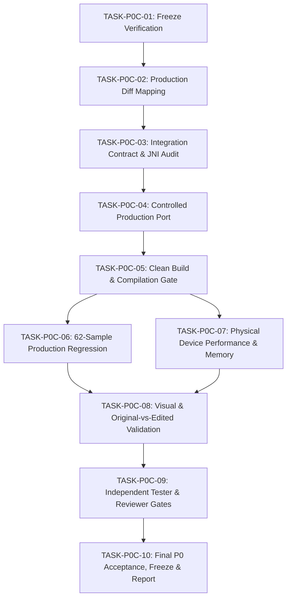

# PHASE P0-C — TASK GRAPH & ORCHESTRATION PLAN

**Phase:** P0-C — Production Integration & Final P0 Acceptance  
**Authority:** Agent 0 — CEO / ORCHESTRATOR  
**Date:** 2026-10-02  
**Governing Standard:** `F:\CONVERT\Development_Workspace_Standard_V2.1_Design_Gated 29-9-2026.txt`  
**Status:** ACTIVE EXECUTION  

---

## 1. Task Graph Dependency DAG

---

## 2. Task Specifications

### TASK-P0C-01: Freeze Verification
- **Owner:** Orchestrator (Agent 0)
- **Dependencies:** None
- **Files Allowed:** `scratch/p0_c_integration/P0_C_PREINTEGRATION_FREEZE_VERIFICATION.md`
- **Files Forbidden:** Production source files (`lib-core-graphics/...`)
- **Acceptance Criteria:** 13/13 SHA-256 hashes match frozen P0-B.2R manifest, verdict `FREEZE_VERIFIED`.
- **Status:** **COMPLETE**.

### TASK-P0C-02: Production Diff Mapping
- **Owner:** Orchestrator / Lead Architect
- **Dependencies:** TASK-P0C-01
- **Files Allowed:** `scratch/p0_c_integration/P0_C_PRODUCTION_DIFF_MAP.md`
- **Files Forbidden:** Direct edits to production code
- **Acceptance Criteria:** Comprehensive mapping of candidate components (Adaptive Letterbox, LowContrast P3, SubjectGraph, ImageContentGuard, Fast Guided Filter, Color Affinity, Semantic Protection, Hairline Softening) to production classes (`HairMattingEngine`, `BiSeNetFaceParser`, `HairEngine`).

### TASK-P0C-03: Integration Contract & JNI Audit
- **Owner:** Lead C++ Engineer
- **Dependencies:** TASK-P0C-02
- **Files Allowed:** `scratch/p0_c_integration/P0_HAIR_MATTE_OUTPUT_CONTRACT.md`, `scratch/p0_c_integration/P0_C_JNI_API_AUDIT.md`
- **Files Forbidden:** Production code
- **Acceptance Criteria:** Strict contract definition for alpha range $[0, 1]$, memory ownership, thread safety, JNI boundary integrity, no memory leaks or dangling pointers.

### TASK-P0C-04: Controlled Production Port
- **Owner:** Senior Native Graphics Engineer
- **Dependencies:** TASK-P0C-03
- **Files Allowed:**
  - `lib-core-graphics/src/main/cpp/include/hair_matting_engine.h`
  - `lib-core-graphics/src/main/cpp/src/hair_matting_engine.cpp`
  - `lib-core-graphics/src/main/cpp/include/ai/bisenet_face_parser.h`
  - `lib-core-graphics/src/main/cpp/src/ai/bisenet_face_parser.cpp`
- **Files Forbidden:**
  - Any model file alterations
  - Any logic drift from frozen P0-B.2R algorithms
  - Any unrelated engines (`body_beauty_engine.cpp`, etc.)
- **Acceptance Criteria:** Complete, zero-drift C++ implementation of the frozen pipeline with `HAIR_MATTING_P0_B2R_ENABLED` feature flag and fallback.

### TASK-P0C-05: Clean Build & Compilation Gate
- **Owner:** Build & CI Engineer
- **Dependencies:** TASK-P0C-04
- **Files Allowed:** Build logs, CMake configuration if needed
- **Files Forbidden:** Logic changes to bypass compiler errors
- **Acceptance Criteria:** Clean build with Gradle (`assembleDebug` / `compileDebugKotlin`) with `--no-daemon` across all supported ABIs (`arm64-v8a`, `armeabi-v7a`, `x86_64`).

### TASK-P0C-06: 62-Sample Production Regression
- **Owner:** QA & Testing Engineer
- **Dependencies:** TASK-P0C-05
- **Files Allowed:** `scratch/p0_c_integration/P0_C_PRODUCTION_REGRESSION_METRICS.csv`, `scratch/p0_c_integration/P0_C_CANDIDATE_VS_PRODUCTION_PARITY.csv`
- **Files Forbidden:** Production code
- **Acceptance Criteria:** All 62 samples evaluated via production call path; 62/62 pass applicable gates; parity with candidate within approved numeric tolerance.

### TASK-P0C-07: Physical Device Performance & Memory
- **Owner:** Hardware Performance Engineer
- **Dependencies:** TASK-P0C-05
- **Files Allowed:** `scratch/p0_c_integration/P0_C_DEVICE_BENCHMARK.csv`
- **Files Forbidden:** Production code
- **Acceptance Criteria:** 50 iterations on Samsung Galaxy SM-A075F; P0 Matting P50 $\le 85\text{ ms}$; peak RSS $\le 512\text{ MB}$; soak test $\ge 100$ iterations with zero monotonic memory growth.

### TASK-P0C-08: Visual & Original-vs-Edited Validation
- **Owner:** Quality & Visual Reviewer
- **Dependencies:** TASK-P0C-06, TASK-P0C-07
- **Files Allowed:** `scratch/p0_c_integration/visual_artifacts/...`
- **Files Forbidden:** Manual retouching of generated images
- **Acceptance Criteria:** Preservation of non-hair regions (face, forehead, ears, neck, clothes, background, UI); 8 visual artifacts per representative case.

### TASK-P0C-09: Independent Tester & Reviewer Gates
- **Owner:** Independent Reviewer & Tester Agents
- **Dependencies:** TASK-P0C-08
- **Files Allowed:** `scratch/p0_c_integration/P0_C_TEST_REPORT.md`, `scratch/p0_c_integration/P0_C_REVIEW_REPORT.md`
- **Files Forbidden:** Production code
- **Acceptance Criteria:** Explicit verdicts `TESTER_PASS` and `REVIEWER_PASS`.

### TASK-P0C-10: Final P0 Acceptance, Freeze & Report
- **Owner:** Orchestrator (Agent 0)
- **Dependencies:** TASK-P0C-09
- **Files Allowed:**
  - `scratch/p0_c_integration/P0_C_ROLLBACK_PLAN.md`
  - `scratch/p0_c_integration/P0_FINAL_PRODUCTION_MANIFEST.csv`
  - `scratch/p0_c_integration/P0_FINAL_FREEZE.sha256`
  - `scratch/p0_c_integration/P0_FINAL_FREEZE_RECORD.md`
  - `scratch/p0_c_integration/P0_FINAL_REPORT.md`
- **Acceptance Criteria:** 25/25 final hard gates pass; single verdict `P0_FINAL_PASS`; stop condition enforced.
