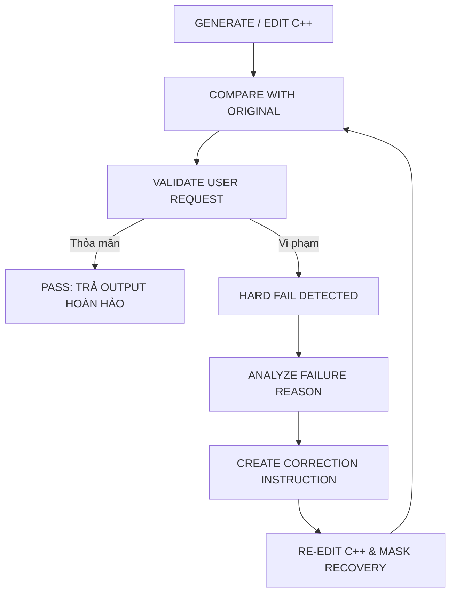

# TIÊU CHUẨN KIỂM ĐỊNH ẢNH SAU CHỈNH SỬA (REFERENCE-BASED PHOTO TEST SPECIFICATION)
# Tham chiếu: F:\CONVERT\com.mt.mtxx.mtxx\Yeucau_Test_anh.txt
# Thư viện tham chiếu: F:\CONVERT\2.txt
# Thẩm quyền: Chủ tịch Tony ban hành cho Dự án CONVERT2 (Meitu Reborn Core C++)

---

## 0. NGUYÊN TẮC CỐT LÕI (CORE PHILOSOPHY)
1. **ẢNH GỐC (ORIGINAL_IMAGE) LÀ GROUND TRUTH** cho mọi vùng, chi tiết, vật thể, bố cục, ánh sáng và bối cảnh mà người dùng KHÔNG yêu cầu thay đổi.
2. **YÊU CẦU NGƯỜI DÙNG (USER_REQUEST) LÀ GROUND TRUTH** cho vùng, đối tượng và thuộc tính mà người dùng muốn thay đổi.
3. **TUYỆT ĐỐI KHÔNG ĐÁNH GIÁ ĐỘC LẬP**: Bất kỳ hình ảnh sau chỉnh sửa (EDITED_IMAGE) nào cũng KHÔNG được phép đánh giá một mình. Mọi đánh giá đều phải là **REFERENCE-BASED VALIDATION** dựa trên bộ 3 ngôi:
   $$\text{ORIGINAL\_IMAGE} + \text{USER\_REQUEST} + \text{EDITED\_IMAGE} \longrightarrow \text{DIFF} \longrightarrow \text{SEMANTIC \& QUALITY GATE} \longrightarrow \text{PASS / NEED\_FIX / FAIL}$$

---

## 1. DỮ LIỆU ĐẦU VÀO BẮT BUỘC (MANDATORY INPUTS)
Mọi ca kiểm thử ảnh trong hệ thống phải có đầy đủ 5 tham số:
1. `ORIGINAL_IMAGE`: Ảnh gốc nguyên bản (chưa qua can thiệp).
2. `EDITED_IMAGE`: Ảnh kết quả sau khi chạy qua thuật toán Core C++ / AI.
3. `USER_REQUEST`: Mô tả yêu cầu chỉnh sửa (text prompt hoặc action command, ví dụ: "Làm thon cằm V-line 50%, giữ nguyên tóc và nền").
4. `TARGET_REGION`: Mặt nạ vùng tác động mục tiêu (Bounding Box hoặc Binary Semantic Mask: Da, Mắt, Cằm, Tóc, Răng, Áo...).
5. `EDIT_PARAMETERS`: Các thông số kỹ thuật (Slider Intensity, 3DMM Parameter ID, Preset ID, LUT Cube, Hex Color...).

---

## 2. BỘ 8 TIÊU CHÍ KIỂM TRA ĐỊNH LƯỢNG (THE 8 TEST DIMENSIONS)

### 2.1. Kiểm Tra Đúng Vị Trí (Edit Position Accuracy)
- **Mục tiêu**: Đảm bảo thuật toán can thiệp chính xác vào đối tượng mục tiêu, không can thiệp lệch hoặc lan sang vùng khác.
- **Tiêu chuẩn đo lường**:
  - Tỷ lệ trùng khớp vùng tác động với `TARGET_REGION`: $\text{IoU} \ge 0.85$.
  - Kiểm tra rò rỉ (Zero Leakage): Vùng ngoài `TARGET_REGION` (nền, tóc, áo, tay chân) phải có biến dạng $\Delta_{\text{pixels}} = 0$ và độ lệch màu $\text{Max Delta} \le 1.0 / 255.0$.
- **Thang điểm**: `POSITION_ACCURACY` = 0 – 100 điểm.

### 2.2. Kiểm Tra Màu Sắc (Color Accuracy)
- **Mục tiêu**: Khi `USER_REQUEST` yêu cầu đổi màu (nhuộm tóc, son môi, màu mắt, đổi màu trang phục, nâng tông da, 3D LUT):
- **Tiêu chuẩn đo lường**:
  - Đối chiếu giữa `TARGET_COLOR` và `EDITED_COLOR` trên các không gian màu: Hue, Saturation, Brightness, CIELAB ($\Delta E_{00}$), Temperature, Tint.
  - **Ràng buộc vật lý**: Không được đạt màu bằng cách làm mất texture vật liệu, triệt tiêu highlight tự nhiên hoặc làm phẳng khối bóng đổ (shadow).
- **Thang điểm**: `COLOR_ACCURACY` = 0 – 100 điểm (hoặc N/A nếu không đổi màu).

### 2.3. Kiểm Tra Form / Hình Dáng (Shape & Geometry Accuracy)
- **Mục tiêu**: Đối chiếu hình học giữa `ORIGINAL_GEOMETRY` và `EDITED_GEOMETRY`:
- **Tiêu chuẩn đo lường**:
  - Tỷ lệ biến dạng giải phẫu (Anatomy) có tự nhiên và đúng ý người dùng không?
  - Đường cong viền (contour) có mượt mà, không bị gãy góc (shear tear) hay méo cục bộ?
  - Nếp gấp quần áo, cúc áo, đường may, hoa văn (seam/button/pattern) có bị kéo dãn phi thực tế không?
  - Có bảo toàn đặc trưng nhận dạng khuôn mặt (Face Identity preservation) không?
- **Thang điểm**: `SHAPE_ACCURACY` = 0 – 100 điểm.

### 2.4. Kiểm Tra Đúng Ý Người Dùng (User Intent Alignment) — *QUAN TRỌNG NHẤT*
- **Nguyên lý tối cao**: Không chỉ hỏi "Ảnh có đẹp không?", mà phải hỏi: **"Ảnh có thực hiện đúng USER_REQUEST không?"**.
- **Quy tắc trừng phạt**:
  - Ví dụ: Người dùng yêu cầu *"Đổi áo thành màu trắng, còn lại giữ nguyên"*. Nếu kết quả sinh ra ảnh rất đẹp nhưng da bị làm trắng, tóc bị đổi kiểu, khuôn mặt bị thay đổi $\longrightarrow$ **FAIL NGAY LẬP TỨC**.
- **Thang điểm**: `USER_INTENT_SCORE` = 0 – 100 điểm.

### 2.5. Kiểm Tra Bảo Toàn Ảnh Gốc (Original Preservation)
- **Phân hoạch không gian ảnh**:
  - $\text{EXPECTED\_CHANGE\_MASK}$: Vùng được phép thay đổi theo `USER_REQUEST`.
  - $\text{EXPECTED\_PRESERVE\_MASK}$: Vùng bắt buộc giữ nguyên tối đa giống `ORIGINAL_IMAGE`.
- **Kiểm tra vùng bảo tồn**:
  - Khuôn mặt (Face Identity & Expression)
  - Dáng điệu (Body Pose & Skeleton)
  - Mái tóc & Sợi tóc bay (Hair volume & Flyaway strands)
  - Phông nền (Background architecture, gym floor, walls, objects)
  - Ánh sáng & Góc chụp máy ảnh (Perspective, Focal length, Lighting direction)
- **Thang điểm**: `UNWANTED_CHANGE_SCORE` = 0 – 100 điểm (Điểm càng thấp càng tốt, yêu cầu $\le 5$ điểm).

### 2.6. Kiểm Tra Lỗi Dị Thường (Artifact Control)
- **Rà soát triệt để các dị tật điểm ảnh**:
  - Mờ nhòe bất thường (abnormal blur), bóng ma (ghosting), viền đôi (double edge), hào quang (halo).
  - Đường nối lộ vết cắt dán (seam line), hoa văn lặp thô (texture repetition), dấu vết AI tổng hợp.
  - Ngón tay/bàn tay lỗi, méo mắt, tóc giả bết khối, da nhựa (plastic skin) mất lỗ chân lông.
  - Quần áo chảy xệ, cúc áo/khóa kéo biến mất, họa tiết đứt gãy, nền tường bị cong lượn sóng.
- **Thang điểm**: `ARTIFACT_SCORE` = 0 – 100 điểm (Điểm càng thấp càng tốt, yêu cầu $\le 5$ điểm).

### 2.7. So Sánh Chất Lượng Kỹ Thuật (Technical Quality)
- **Độ sắc nét (Sharpness)**: Gradient biên rõ ràng, không suy giảm MTF.
- **Chi tiết & Lỗ chân lông (Micro-texture)**: Bảo lưu cấu trúc vi lỗ chân lông da $\ge 75\%$ theo chuẩn C++ `skin_makeup_engine`.
- **Nhiễu hạt (Noise consistency)**: Hạt nhiễu ISO của vùng chỉnh sửa phải khớp với ảnh gốc, không tạo mảng mịn trơn láng dị thường.

### 2.8. Tính Tự Nhiên & Hòa Nhập (Naturalness & Integration)
- Vùng can thiệp hòa nhập tự nhiên vào tổng thể bức ảnh.
- Ánh sáng cục bộ đồng nhất với hướng nguồn sáng chính của bối cảnh.
- Đánh giá phân tách rõ: `TECHNICAL_IMPROVEMENT`, `USER_INTENT_IMPROVEMENT` và `VISUAL_PREFERENCE_ESTIMATE` (không đánh đồng cảm tính cá nhân).

---

## 3. BẢNG ĐIỂM TEST BẮT BUỘC (MANDATORY SCOREBOARD)

| TIÊU CHÍ ĐÁNH GIÁ | THANG ĐIỂM | ĐIỀU KIỆN ĐẠT (PASS CRITERIA) | KẾT QUẢ |
|:---|:---:|:---:|:---:|
| **1. Edit Position** | 0 – 100 | $\ge 90$ & Zero Leakage | PASS / FAIL |
| **2. Color Accuracy** | 0 – 100 | $\ge 85$ (hoặc N/A) | PASS / FAIL / N/A |
| **3. Shape Accuracy** | 0 – 100 | $\ge 85$ (hoặc N/A) | PASS / FAIL / N/A |
| **4. User Intent** | 0 – 100 | $\ge 95$ | PASS / FAIL |
| **5. Original Preservation** | 0 – 100 | $\le 5$ (Unwanted Change) | PASS / FAIL |
| **6. Artifact Control** | 0 – 100 | $\le 5$ (Artifact Score) | PASS / FAIL |
| **7. Technical Quality** | 0 – 100 | $\ge 85$ | PASS / FAIL |
| **8. Naturalness** | 0 – 100 | $\ge 85$ | PASS / FAIL |

---

## 4. QUY TẮC RỚT HẠNG TRỰC TIẾP (HARD FAIL CRITERIA)
Ảnh đầu ra bị coi là **FAIL NGAY LẬP TỨC** nếu phạm phải bất kỳ điều nào sau đây:
1. **Sửa sai đối tượng / sai vùng** (ví dụ: yêu cầu nâng mũi nhưng làm to mắt hoặc làm méo má).
2. **Không thực hiện yêu cầu chính** của người dùng.
3. **Thay đổi khuôn mặt / mất Identity** khi người dùng không yêu cầu.
4. **Làm biến dạng background** khi yêu cầu giữ nguyên nền.
5. **Thay đổi form dáng sản phẩm / trang phục** khi chỉ yêu cầu đổi màu hoặc chất liệu vải.
6. **Làm mất chi tiết gốc quan trọng** (cúc áo, đường may, hình xăm, nốt ruồi đặc trưng, khuyên tai).
7. **Sinh thêm hoặc xóa vật thể ngoài ý muốn**.
8. **Lỗi giải phẫu cơ thể nghiêm trọng** (tay 6 ngón, khớp xương gãy méo, mắt lé dị thường).
9. **Ảnh output bị lỗi dữ liệu / khuyết tật hiển thị**.

---

## 5. CƠ CHẾ TỰ ĐỘNG SỬA ĐỔI (AUTO-RETRY PIPELINE)
Khi gặp kết quả FAIL, **TUYỆT ĐỐI KHÔNG TRẢ ẢNH LỖI CHO NGƯỜI DÙNG**. Hệ thống phải tự động kích hoạt vòng lặp khắc phục:

### Báo cáo nguyên nhân thất bại (Failure Report Format)
- `FAILURE_REASON`: `wrong_position` | `wrong_color` | `wrong_shape` | `unwanted_change` | `identity_changed` | `background_changed` | `clothing_detail_changed` | `artifact` | `unnatural` | `user_intent_not_satisfied`.
- `CORRECTION_PLAN`: Ví dụ: *“Áo đã đổi sang màu trắng nhưng vùng mặt bị thay đổi sắc độ. Khắc phục: Khóa cứng vùng mặt bằng Preserve Mask, chỉ cho phép luồng màu can thiệp vào Garment Semantic Mask, khôi phục vùng da từ Original Image”*.

---

## 6. MA TRẬN ÁNH XẠ THƯ VIỆN THAM CHIẾU (F:\CONVERT\2.txt)

Để đạt được chất lượng kiểm định khắt khe trên, toàn bộ kiến trúc C++ Native và AI của CONVERT2 được chuẩn hóa kế thừa và chưng cất từ danh mục các thư viện mã nguồn mở hàng đầu thế giới:

### A. Phân Đoạn & Nhận Diện Giải Phẫu (Semantic Parsing & Landmark)
- **CoinCheung/BiSeNet**: Phân đoạn ngữ nghĩa 19 lớp giải phẫu khuôn mặt (đã tích hợp vào `bisenet_face_parser.cpp`).
- **lazyboooooy/hair_seg-cmake**: Phân tách tóc và da đầu chính xác từng sợi tóc.
- **MediaPipe (Google)**: 478 điểm Facemesh Dense Landmark, phát hiện chuyển động mắt, khóe miệng.
- **CMU OpenPose & MMPose**: Khung xương WholeBody 133 điểm nhận diện toàn thân, khớp chi và dáng điệu người mẫu.

### B. Thử Đồ, Thay Đồ & Mô Phỏng Vải Vóc (Virtual Try-On & Cloth Simulation)
- **yisol/IDM-VTON**: Mô hình High-fidelity Virtual Try-on thích ứng nếp gấp quần áo tự nhiên.
- **PositionBasedDynamics & PBD_Cloth_Simulation & ClothSimGL**: Mô phỏng va chạm vải vóc với bề mặt cơ thể 3D trong C++.
- **libigl & Pixar OpenSubdiv**: Biến dạng lưới đa giác C++ (As-Rigid-As-Possible deformation) và làm mịn bề mặt phân chia Subdiv.
- **Bullet3 Physics**: Động lực học va chạm vật lý cho trang sức, phụ kiện tóc và trang phục thời gian thực.
- **NVlabs/nvdiffrast**: Differentiable rasterization kết nối giữa 3D Mesh trang phục và ảnh 2D.

### C. Tổng Hợp Ảnh & Khử Nhiễu (Image Synthesis & Inpainting)
- **NVIDIA pix2pixHD & SPADE (NVlabs)**: Tổng hợp ảnh độ phân giải cao từ bản đồ semantic, phục hồi da đầu và xóa nếp nhăn.
- **NVlabs/imaginaire & MUNIT**: Chuyển đổi phong cách trang phục đa thể loại bảo tồn cấu trúc.
- **automatic1111/stable-diffusion-webui & NVIDIA addit / I2SB**: Kỹ thuật inpainting cục bộ có điều kiện.

### D. Hệ Thống Biên Tập Video C++ (VideoCore Architecture)
- **FFmpeg**: MediaCore — Decode/Encode, mux/demux, scale YUV $\leftrightarrow$ RGBA.
- **OpenTimelineIO (OTIO) & libopenshot**: TimelineCore — Mô hình đường thời gian đa track, keyframe, chuyển cảnh.
- **libplacebo**: GPUCore — Render shader GLSL/Vulkan chất lượng cao.
- **Real-ESRGAN NCNN Vulkan & RIFE NCNN Vulkan**: Tăng độ phân giải siêu nét (Super Resolution) và nội suy chuyển động 60 FPS mượt mà.
- **Robust Video Matting / BackgroundMattingV2**: Tách nền người video thời gian thực không cần phông xanh.
- **Tencent NCNN / TNN**: Lõi thực thi suy luận AI tối ưu trên chip ARM mobile (NEON, FP16, OpenMP).
